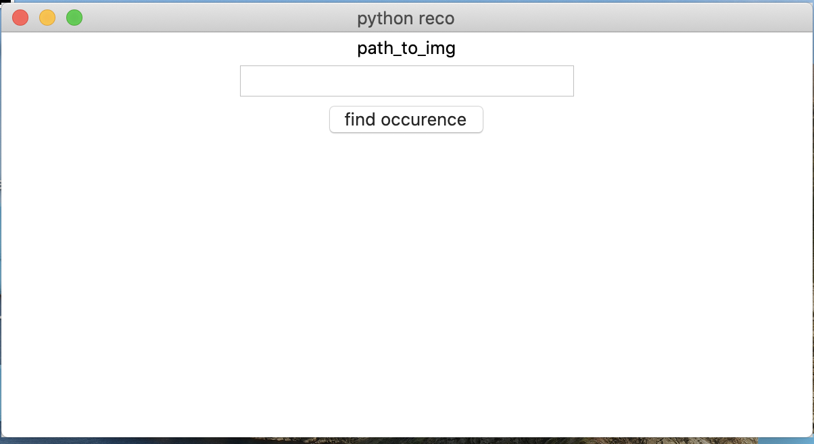

# python RECOGNATION

## this project is for educational purpose

## you need pip to run this project
### i create a sh script you will download all package for you
### but if you the script don't word you need
- tkinter
- face_recognition
- PIL

## to run this project you need to type in a term
- `python3 RecoFace.py`

## basic usage
- #### for add face into the DataBase you just need to move your photo into le database folder

- #### the gui is pretty simple :

- - just type into path_to_img input the path were you want to use facial recognation

#### i hope you enjoy this personnal project !